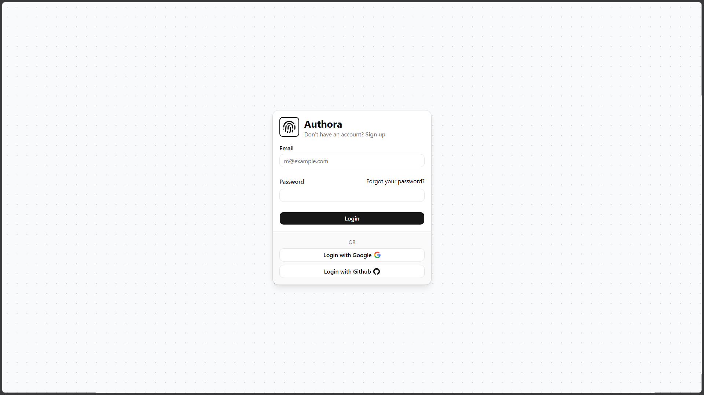
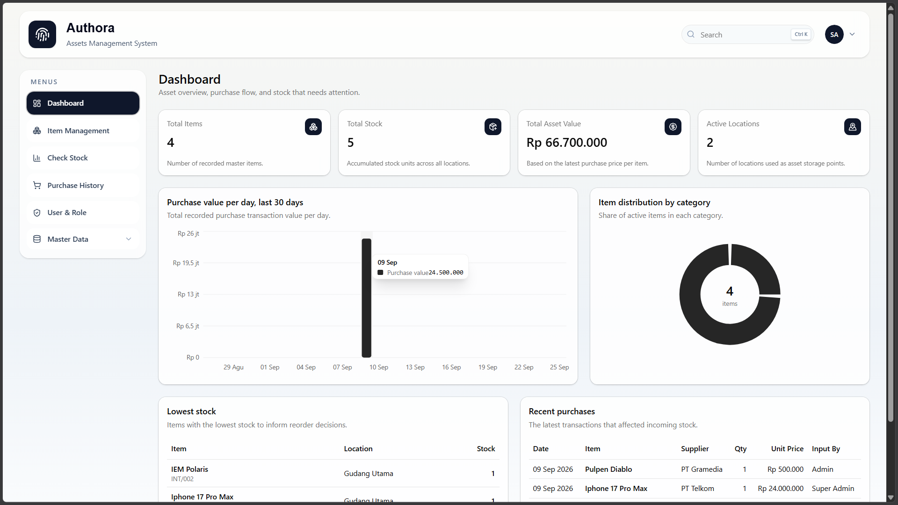
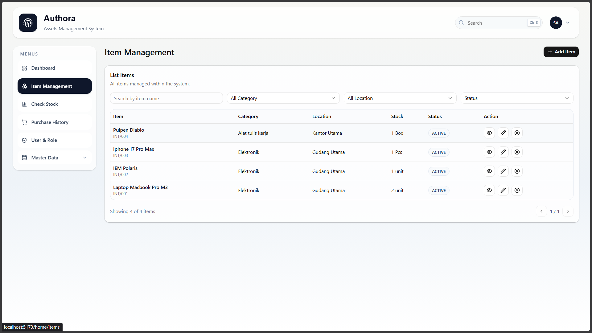
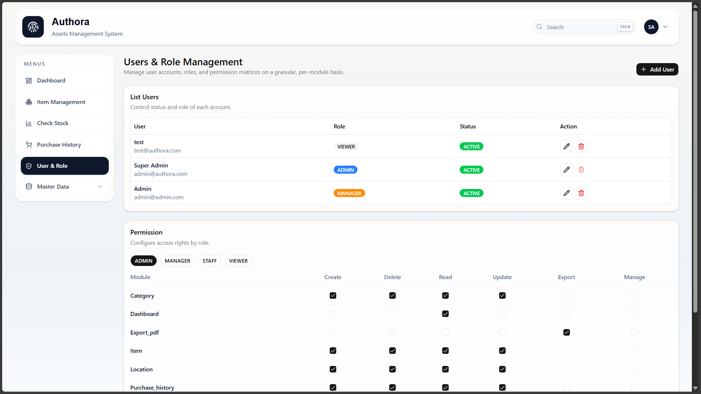

# Authora Frontend

Authora is a React-based asset management dashboard for handling authentication, inventory data, stock monitoring, purchase records, master data, users, roles, and permission-based access. This frontend is built with Vite, React Router, Tailwind CSS, shadcn-style UI components, Axios, Recharts, and Framer Motion.

The app connects to the Authora backend API through `VITE_API_URL` and uses token-based authentication for protected dashboard routes.

## Features

- Authentication pages for login, sign up, forgot password, verification code, password reset, and OAuth callback handling.
- Protected application shell with role-aware navigation.
- Dashboard overview for asset and inventory activity.
- Item management with detail and form dialogs.
- Stock, purchase history, and supplier-related workflows.
- Master data pages for categories, locations, and suppliers.
- User and role management with permission-aware access.
- Command palette support for faster navigation.

## Tech Stack

- React 19
- Vite
- React Router
- Tailwind CSS
- Axios
- Recharts
- Lucide React
- Radix UI / shadcn-style components
- Framer Motion

## Project Structure

```text
src/
  components/      Shared UI and asset dashboard components
  context/         Authentication and asset state providers
  hooks/           Reusable app hooks
  lib/             API helpers, utilities, and asset helpers
  pages/           Auth, dashboard, item, stock, purchase, user, and master data pages
  services/        API service modules
  styles/          Global styles
```

## Environment Variables

Create a `.env` file in the frontend root and point it to the backend API:

```env
VITE_API_URL=http://localhost:3000/api
```

## Getting Started

Install dependencies:

```bash
npm install
```

Run the development server:

```bash
npm run dev
```

Build for production:

```bash
npm run build
```

Preview the production build:

```bash
npm run preview
```

## Preview

### Login



### Dashboard



### Item Management



### User and Role Management


